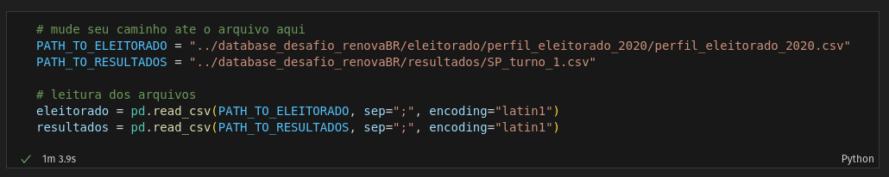
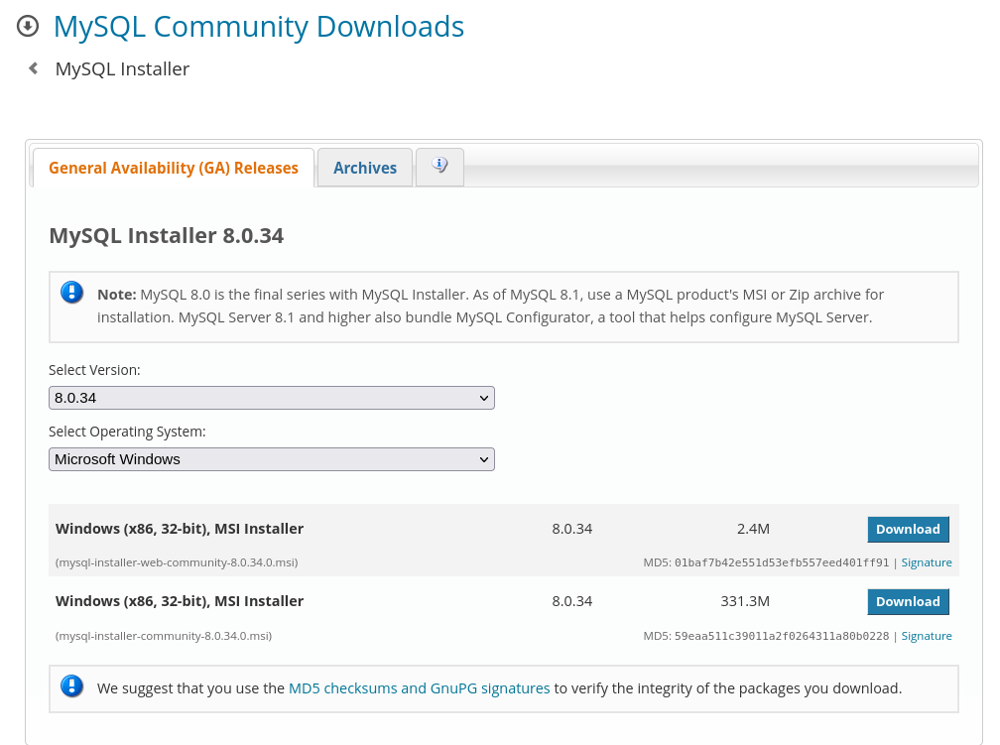
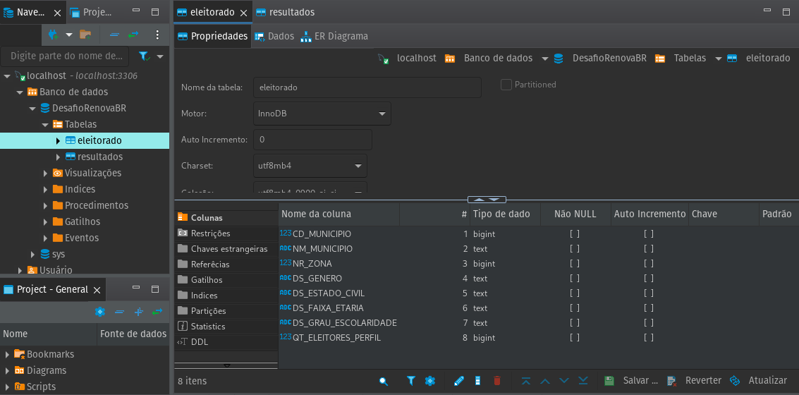
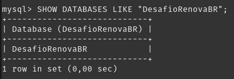

# **Desafio Técnico: RenovaBR**

Este projeto implementa técnicas típicas de Ciência de Dados ao desafio proposto pelo **RenovaBR**. O desafio consiste em **analisar dados eleitorais do estado de São Paulo e seus municípios nas eleições de 2020**. Conforme sugerido pelo RenovaBR no [documento que descreve o desafio](../desafio-tecnico.pdf), o projeto segue o seguinte roteiro:

🧹 Pré-processamento e tratamento dos dados

🐬 Dump dos dados tratados em um banco de dados relacional

⌨️ Acesso aos dados via SQL em Python

📊 Análise Exploratória dos Dados

A análise exploratória estará conjugada à resolução de algumas questões propostas, mas não se limitará a elas. O objetivo é explorar os dados e extrair informações relevantes para a tomada de decisão.

## **Instruções gerais para replicação do projeto**

A primeira célula do notebook `analysis.ipynb` contém as informações necessárias sobre bibliotecas utilizadas, suas versões e sistema operacional no qual o projeto foi desenvolvido. 

LEMBRAR DE ADICIONAR O PRINT DA PRIMEIRA CÉLULA AQUI

Ao longo da implementação, forneço instruções para replicação do projeto - por exemplo, quais variáveis devem ser alteradas para que seja possível acessar os arquivos do projeto em outro ambiente.



> Por conta do limite de tamanho dos arquivos no GitHub, é necessário adicionar manualmente a pasta com os dados.

O único componente do projeto que deverá ser replicado com um pouco mais de cautela é o banco de dados. Para isso, é necessário ter o MySQL instalado e configurado na máquina. Informações bastante detalhadas para *download* e configuração do MySQL podem ser encontradas [aqui](https://www.digitalocean.com/community/tutorials/how-to-install-mysql-on-ubuntu-20-04). Essas instruções foram precisamente as que segui para instalar o MySQL no meu sistema operacional (Ubuntu 22.04), cujo comando é tão simples quanto:

```bash
sudo apt install mysql-server
```

As informações do [link]((https://www.digitalocean.com/community/tutorials/how-to-install-mysql-on-ubuntu-20-04)) indicado são importantes para que o MySQL seja instalado e configurado corretamente. 

Instaladores para outros sistemas operacionais podem ser encontrados [neste link](https://dev.mysql.com/downloads/installer/).



Para acompanhamento do funcionamento do banco de dados, utilizei o DBeaver, cujo download pode ser feito [aqui](https://dbeaver.io/download/). 



Note que esta última etapa não é estritamente necessária para replicação do projeto, já que também é possível acessar o banco de dados via terminal ou via Python.

